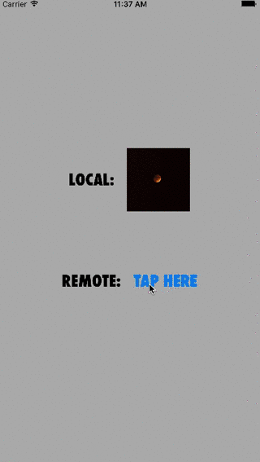

# Optik

[](https://travis-ci.org/prolificinteractive/Optik)
[](https://img.shields.io/cocoapods/v/Optik.svg)
[](http://cocoadocs.org/docsets/Optik)
[](http://cocoadocs.org/docsets/Optik)

## Description

Optik provides a simple viewing experience for a set of images, whether stored locally or remotely.



## Requirements

* iOS 8.0+

## Installation

Optik is available through [CocoaPods](http://cocoapods.org). To install it, simply add the following line to your `Podfile`:

```ruby
pod "Optik"
```

## Usage

Optik can be used to display images stored either locally or remotely.

### Displaying Images

#### Local Images

Local images can be displayed by creating an image viewer with an array of images:

```swift
let imageViewer = Optik.imageViewerWithImages([
		UIImage(named: "image1.jpg")!,
		UIImage(named: "image2.jpg")!,
		UIImage(named: "image3.jpg")!
    ]
)

presentViewController(imageViewer, animated: true, completion: nil)
```

#### Remote Images

For remote images, an array of `NSURLs` should be provided - as well as an object conforming to the `ImageDownloader` protocol:

```swift
let imageDownloader = MyImageDownloader()

let imageViewer = Optik.imageViewerWithURLs([
        NSURL(string: "https://somewebsite.com/image1.png")!,
        NSURL(string: "https://somewebsite.com/image2.png")!,
        NSURL(string: "https://somewebsite.com/image3.png")!
    ],
    imageDownloader: imageDownloader
)

presentViewController(imageViewer, animated: true, completion: nil)
```

### Customizing the Image Viewer

#### Dismiss Button

The dismiss button image and position can be customized.

To indicate a custom dismiss button image, provide a `dismissButtonImage:` parameter when creating an image viewer:

```swift
let dismissButtonImage = UIImage(named: "MyDismissButton")

let imageViewer = Optik.imageViewerWithImages([
        UIImage(named: "image1.jpg")!
    ],
    dismissButtonImage: dismissButtonImage
)
```

To indicate a position for the dismiss button, provide a `dismissButtonPosition:`

```swift
let imageViewer = Optik.imageViewerWithImages([
        UIImage(named: "image1.jpg")!
    ],
    dismissButtonPosition: .TopTrailing
)
```

#### Activity Indicator

When fetching remote images, an activity indicator is displayed while images are loaded. To indicate a custom activity indicator color, provide an `activityIndicatorColor:` parameter when creating an image viewer:

```swift
let imageViewer = Optik.imageViewerWithURLs([
        NSURL(string: "https://somewebsite.com/image1.png")!
    ],
    imageDownloader: imageDownloader,
    activityIndicatorColor: UIColor.redColor()
)
```

## Contributing to Optik

To report a bug or enhancement request, feel free to file an issue under the respective heading.

If you wish to contribute to the project, fork this repo and submit a pull request.

## License


Copyright (c) 2016 Prolific Interactive

Marker is maintained and sponsored by Prolific Interactive. It may be redistributed under the terms specified in the [LICENSE] file.

[LICENSE]: ./LICENSE
